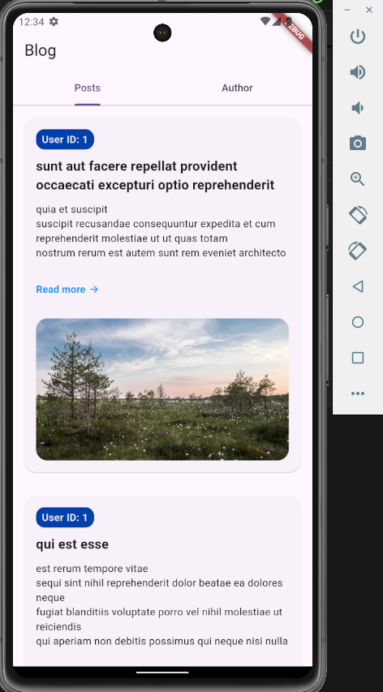

# Flutter Blog App

This project is a **Flutter-based Blog App** that demonstrates how to fetch, display, and paginate blog posts from a repository, along with implementing a simple author page that links to the author's GitHub profile.

## Features

- Fetches posts from a mock repository and displays them in a paginated list.
- Differentiates between mobile and web layouts, using a **list view** for mobile and a **grid view** for web.
- Integrates BLoC architecture for state management.
- Provides detailed post views upon clicking on posts.
- Includes a dedicated author page with a GitHub link to the author's profile.

## Project Structure

The project follows a **layered architecture** based on the BLoC pattern, divided into the following directories:

### `blocs`
Contains the BLoC (Business Logic Component) classes, which are responsible for managing the app's state and business logic. The app uses a `PostBloc` to handle the fetching and pagination of blog posts.

- `post_bloc.dart`: The main BLoC class that fetches posts and manages state.
- `post_event.dart`: Defines the various events that the BLoC will respond to, such as fetching posts.
- `post_state.dart`: Defines the possible states of the BLoC, including initial, loading, success, and failure states.

### `models`
Contains the data models used in the app.

- `post_model.dart`: Represents a single blog post, with fields such as `userId`, `id`, `title`, and `body`.

### `repositories`
Contains the repository that handles data fetching.

- `post_repository.dart`: Mock repository that simulates fetching posts. In a production app, this would likely be replaced with actual API calls.

### `screens`
Contains the main screens (UI pages) of the app.

- `home_screen.dart`: The main screen of the app that displays the list of posts or grid of posts based on screen width. It also contains a tab for the author page.
- `post_detail_screen.dart`: Displays detailed information about a selected post.

### `widgets`
Contains reusable widgets used across the app.

- `post_widget.dart`: Displays a single post in the list/grid, including the title, body, and an image. It also provides a button to navigate to the detailed post view.

## BLoC Architecture

This app uses the **BLoC pattern** for state management, which separates business logic from the UI. 

### How BLoC works:

1. **Events**: The `PostBloc` listens for events like `FetchPosts`, which signals that the app should retrieve more posts.
   
2. **State**: The `PostBloc` maintains a state, such as `PostLoading`, `PostSuccess`, or `PostFailure`. The UI responds to changes in this state to update what is shown on the screen.

3. **Repository**: The BLoC uses a repository (`PostRepository`) to fetch posts, allowing for easy separation between data fetching and business logic.

### Example Flow:

- The app dispatches a `FetchPosts` event.
- `PostBloc` fetches posts from the `PostRepository`.
- If the posts are successfully fetched, the BLoC emits a `PostSuccess` state.
- If an error occurs, the BLoC emits a `PostFailure` state.
  
## Web & Mobile Layout

The app is **responsive**, providing a different layout for mobile and web:

- **Mobile**: Displays posts in a **ListView** (single-column layout).
- **Web**: Displays posts in a **GridView** with 4 columns.

This is achieved by using a `LayoutBuilder` in the `home_screen.dart` to adjust the layout depending on the screen width.

## GitHub Profile Page

The app includes a second tab, **"Author"**, which contains information about the app's author. This page features:

- Author's GitHub avatar.
- Author's name and alias.
- A button that links to the author's GitHub profile.

The GitHub profile link is handled using `url_launcher`, which opens the link in an external browser.

## Dependencies

Here are the main dependencies used in this project:

```yaml
dependencies:
  flutter:
    sdk: flutter
  flutter_bloc: ^8.1.4
  http: 1.2.2
  cupertino_icons: ^1.0.8
  equatable: ^2.0.5
  bloc: ^8.1.4
  infinite_scroll_pagination: ^4.0.0
  url_launcher: ^6.3.1

dev_dependencies:
  flutter_test:
    sdk: flutter
  flutter_lints: ^4.0.0
```

## How to Run

To run the project locally:

1. Clone the repository:
   ```bash
   git clone https://github.com/kaikrmen/flutter_blog_app.git
   ```

2. Install dependencies:
   ```bash
   flutter pub get
   ```

3. Run the app on a device or emulator:
   ```bash
   flutter run
   ```

4. To run the app on the web:
   ```bash
   flutter run -d chrome
   ```

## Screenshots

Below are some example screenshots showing the web and mobile layouts:

- **Mobile**:
  
  

- **Web**:
  
  